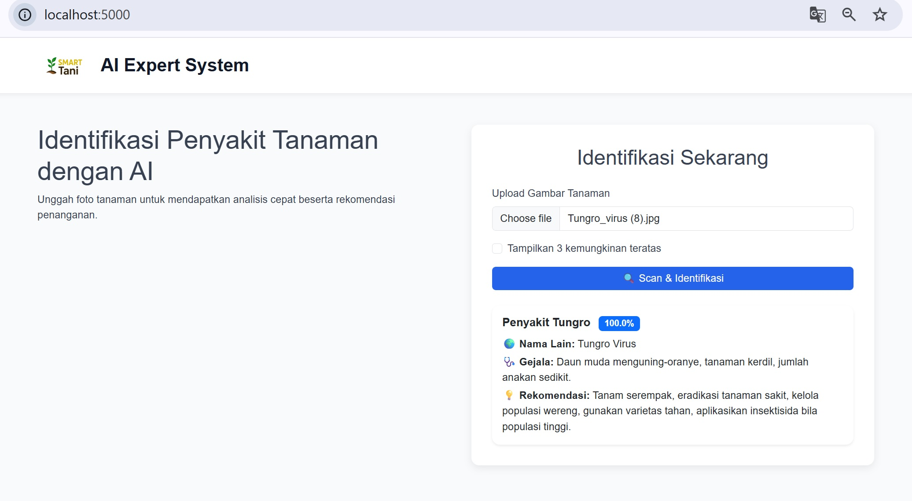

# 🌾 SMART Tani AI

Aplikasi berbasis **Flask** + **TensorFlow/Keras** untuk mengidentifikasi penyakit dan hama tanaman padi dari gambar daun.  
Aplikasi ini menggunakan model **EfficientNetV2** yang dilatih pada dataset penyakit/hama padi, dan memberikan informasi berupa:
- Nama penyakit/hama (Indonesia + alias/English)
- Gejala yang muncul
- Rekomendasi penanganan

## 🚀 Fitur
- Upload gambar daun padi langsung dari web.
- Identifikasi penyakit/hama otomatis dengan model AI.
- Menampilkan confidence score dan top-k prediksi.
- Database penyakit/hama lengkap dengan nama lokal, alias (English), gejala, dan rekomendasi.
- Tampilan clean & responsif (Bootstrap 5).
- File upload otomatis dihapus setelah proses (agar folder tidak penuh).

## 🛠️ Teknologi
- Python 3.10+
- Flask 2.x
- TensorFlow / Keras 2.19
- Bootstrap 5
- JSON sebagai database penyakit (`diseases.json`)

## 📂 Struktur Proyek
```
project-root/
├── app.py              # Main Flask app
├── ai_module.py        # Logic untuk memetakan hasil inferensi ke database
├── image_infer.py      # Load & inferensi model Keras
├── models/             # Folder model (.keras)
├── uploads/            # Folder temporary upload (otomatis dihapus setelah diproses)
├── static/
│   └── images/logo.png # Logo aplikasi
├── templates/
│   └── home.html       # Halaman utama (upload & hasil identifikasi)
├── diseases.json       # Database penyakit padi
└── requirements.txt    # Daftar dependency Python
```

## ⚙️ Instalasi Lokal

1. **Clone repo**
   ```bash
   git clone https://github.com/miftakhurrokhmat/amikomsolo_farmer_ai_expert.git
   cd amikomsolo_farmer_ai_expert
   ```

2. **Buat virtual environment (opsional tapi direkomendasikan)**
   ```bash
   python -m venv venv
   source venv/bin/activate   # Linux / Mac
   venv\Scripts\activate      # Windows
   ```

3. **Install dependencies**
   ```bash
   pip install -r requirements.txt
   ```

4. **Siapkan model**
   - Letakkan file model hasil training (`.keras`) di folder `models/`.
   - Secara default, aplikasi akan mencari `models/E6_efficient.keras`.

5. **Jalankan aplikasi**
   ```bash
   python app.py
   ```
   Aplikasi akan berjalan di:
   ```
   http://localhost:5000
   ```

---

## 🧪 Menjalankan di Google Colab

1. **Upload project & masuk folder**  
   ```python
   from google.colab import drive
   drive.mount('/content/drive')

   %cd /content/drive/MyDrive/smart-tani-ai
   ```

2. **Install dependencies**
   ```python
   !pip install -r requirements.txt
   ```

3. **Jalankan Flask di Colab**  
   Gunakan `flask` + `ngrok` untuk akses dari browser:
   ```python
   !pip install flask-ngrok
   ```

   ```python
   from flask_ngrok import run_with_ngrok
   from app import app

   run_with_ngrok(app)   # start ngrok when app.run() is called
   app.run()
   ```

4. **Buka URL ngrok** yang muncul untuk akses aplikasi.

---

## 📸 Screenshot
Tampilan antarmuka web:



---

## 🔮 To-Do / Future Work
- Tambah dukungan multi-tanaman (jagung, kedelai, dll).
- Deploy ke cloud (Heroku / Railway / GCP).
- Tambah multi-bahasa (English/Indonesia).
